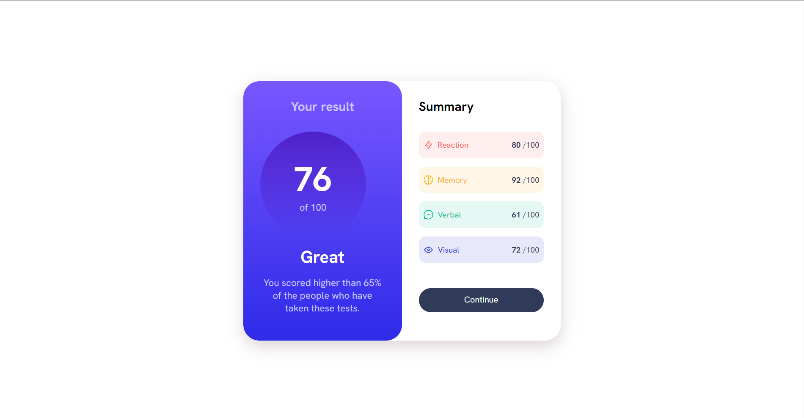

# Frontend Mentor - Results summary component solution

This is a solution to the [Results summary component challenge on Frontend Mentor](https://www.frontendmentor.io/challenges/results-summary-component-CE_K6s0maV). Frontend Mentor challenges help you improve your coding skills by building realistic projects. 

## Table of contents

- [Overview](#overview)
  - [The challenge](#the-challenge)
  - [Screenshot](#screenshot)
  - [Links](#links)
- [My process](#my-process)
  - [Built with](#built-with)
  - [What I learned](#what-i-learned)
  - [Continued development](#continued-development)
  - [Useful resources](#useful-resources)
- [Author](#author)

## Overview

### The challenge

Users should be able to:

- View the optimal layout for the interface depending on their device's screen size
- See hover and focus states for all interactive elements on the page

### Screenshot

### Links

- Live Site URL: [Add live site URL here](https://your-live-site-url.com)

## My process

### Built with

- Semantic HTML5 markup
- CSS custom properties
- Flexbox
- CSS Grid

### What I learned
From this project i have learn lot of like beautiful color"gradient" and some css code....., Thank you for reading.

### Continued development

anyway I'm not good at now, the best way to improve i will more practice to do the best and never stop learning. last is i will say that thank you for reading ___

### Useful resources

- [w3schools](https://www.w3schools.com/) - This helped me for some guide css. I really liked this website and will use it going forward..

## Author

- Frontend Mentor - [@maipenrai23](https://www.frontendmentor.io/profile/maipenrai23)

